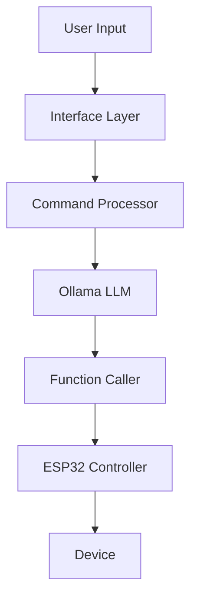

# AI Voice Control Interface - Agents & Function calling (3D Lab Training)

This project demonstrates an AI-powered voice control interface using various technologies such as Pygame, OpenCV, and speech recognition, with GPU acceleration support for improved performance. The interface allows users to control an ESP32 LED/bulb using voice commands or text input.


## Key Features
- Voice/text command processing with LLM
- Real-time visual feedback with GPU acceleration
- Asynchronous command handling
- ESP32 device control
- CUDA-enabled processing support

## Hardware Requirements
- CUDA-compatible GPU (recommended)
- ESP32 development board
- Microphone for voice input

[🔍 Why GPU Acceleration Matters - Full Details](https://github.com/benny-png/3D_LAB_AI_Training/blob/main/why_gpu_for_AI/why_you_need_a_GPU_(GPU_vs_CPU)_3D_Lab_training.ipynb)

<details>
<summary>Performance Comparison</summary>

Example matrix operation (20000x20000):
- CPU time: 213.05 seconds
- GPU time: 3.73 seconds
- GPU speedup: 57.15x faster

</details>

## Table of Contents
1. [Overview](#overview)
2. [System Architecture](#system-architecture)
3. [Installation Guide](#installation-guide)
4. [Setup Instructions](#setup-instructions)
5. [Interface Components](#interface-components)
6. [Programming Guide](#programming-guide)
7. [Function Calling with Ollama](#function-calling-with-ollama)
8. [ESP32 Integration](#esp32-integration)
9. [Troubleshooting](#troubleshooting)
10. [Training Exercises](#training-exercises)

## Overview
This system demonstrates AI agency through voice/text control of ESP32 devices, featuring:
- Voice command processing
- Real-time visual feedback
- Asynchronous command handling
- ESP32 device control

## System Architecture


## Installation Guide

### 1. System Requirements
```bash
# Ubuntu/Debian Dependencies
sudo apt-get update
sudo apt-get install -y \
    python3-dev \
    portaudio19-dev \
    python3-pyaudio \
    ffmpeg \
    libsm6 \
    libxext6
```

### 2. Python Environment
```bash
python -m venv .venv
source .venv/bin/activate  # Linux/Mac
.venv\Scripts\activate     # Windows
```

### 3. Package Installation
```bash
pip install -r requirements.txt
```

### 4. Ollama Setup
```bash
# Install Ollama
curl -fsSL https://ollama.com/install.sh | sh

# Install Models
ollama pull llama3.2:3b
```

## Setup Instructions

### 1. File Structure
```
project/
├── esp32_voice_control.py
├── requirements.txt
├── assets/
│   └── cool_ai_animation.mp4
└── README.md
```

### 2. Configuration
```python
# ESP32 Settings
ESP_IP = "192.168.0.249"
VIDEO_PATH = "assets/cool_ai_animation.mp4"
```

## Interface Components

### Visual Elements
```python
# Screen Dimensions
SCREEN_WIDTH = VIDEO_DISPLAY_WIDTH
SCREEN_HEIGHT = VIDEO_DISPLAY_HEIGHT + PADDING

# UI Elements
START_BUTTON = pygame.Rect(...)
STOP_BUTTON = pygame.Rect(...)
SEND_BUTTON = pygame.Rect(...)
INPUT_BOX = pygame.Rect(...)
```

## Programming Guide

### 1. Command Processing
```python
def process_command_thread():
    while True:
        user_input = command_queue.get()
        response = ollama.chat(
            model='llama3.2:3b',
            messages=[{
                'role': 'user', 
                'content': user_input
            }],
            tools=[control_esp_light],
        )
```

### 2. Voice Recognition
```python
def listen_for_command():
    with sr.Microphone() as source:
        recognizer.adjust_for_ambient_noise(source)
        audio = recognizer.listen(source)
        command = recognizer.recognize_google(audio)
```

## Function Calling with Ollama

### 1. Function Definition
```python
def control_esp_light(state: str) -> str:
    """
    Control ESP32 LED state.
    Args:
        state: "ON" or "OFF"
    Returns:
        str: Operation result
    """
```

### 2. LLM Integration
```python
tools = [{
    "name": "control_esp_light",
    "description": "Control LED state",
    "parameters": {
        "type": "object",
        "properties": {
            "state": {
                "type": "string",
                "enum": ["ON", "OFF"]
            }
        }
    }
}]
```

## ESP32 Integration

### 1. ESP32 Code
```cpp
#include <WiFi.h>
const char* ssid = "Your_WiFi_Name";
const char* password = "Your_WiFi_Password";
WiFiServer server(80);

void setup() {
    pinMode(LED_PIN, OUTPUT);
    WiFi.begin(ssid, password);
}
```

### 2. HTTP Control
```python
def control_device(state):
    url = f"http://{ESP_IP}/{'H' if state == 'ON' else 'L'}"
    response = requests.get(url)
    return response.status_code == 200
```

## Troubleshooting

### Common Issues
1. **Audio Device Not Found**
   ```bash
   sudo apt-get install python3-pyaudio
   ```

2. **Ollama Connection Error**
   ```bash
   ollama serve
   ```

3. **ESP32 Connection Failed**
   - Check WiFi connection
   - Verify IP address
   - Test ESP32 endpoint

## Training Exercises

### Exercise 1: Basic Setup
1. Install dependencies
2. Configure ESP32
3. Test voice recognition

### Exercise 2: Custom Commands
1. Add new functions
2. Define LLM tools
3. Test function calling

### Exercise 3: Interface Customization
1. Modify UI elements
2. Add new controls
3. Enhance visual feedback

## Additional Resources
- [Ollama Documentation](https://ollama.com/docs)
- [ESP32 WiFi Guide](https://docs.espressif.com)
- [PyGame Tutorial](https://pygame.org/docs)

This documentation is maintained by 3D & Robotics Lab. For updates and support, visit our [GitHub repository](https://github.com/benny-png/3D_LAB_AI_Training).